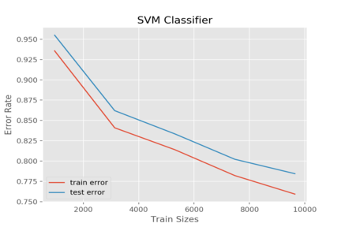

Final Report
========

### Final Report Video:

### Project Summary:
The goal of our project is to classify Minecraft biomes using a Convolutional Neural Network and screenshots of the game as training and input data. This is a computer vision and image classification project that is not only able to print out the biome a Malmo agent is in simply by taking screenshots and classifying the images, but also compares a baseline SVM classification algorithm to a more advanced Convolutional Neural Network.

### Approaches:
To gather image data for training our classification algorithms, we run a Malmo mission in which the agent spawns in a single biome, and teleports to 100 different locations using "tp" commands and a random number generator and takes 8 screenshots while spinning around. For our screenshot script, we used the modules win32gui, win32ui, ctypes, and PIL. It uses win32gui to locate the active Minecraft application and get its dimensions of the bounding rectangle. It then retrieves its device context and making a replica, making it compatible specifically to Minecraft. It then creates a bitmap with the device context as well as the dimensions. It then prints the client into the device context and creates an image using the bitmap information. If an image has been successfully created, it will be saved as a jpg file in the same directory as the script. After the mission, there is a total of 800 screenshots per biome to train with, separated into their own directories. We have a total of 21,600 images of 27 Minecraft biomes.

For our baseline, we used the support vector machine classifier provided from the sklearn module. To utilize this classifier with images, we needed to convert the images to grayscale and get a histogram of oriented gradients (HOG) for each one. In order to do this, we used the libraries sklearn, skimage, PIL, cv2, os, and numpy. Using the main directory, we looped through each sub-directory containing the four different biomes and used cv2 to read the images, turn them to grayscale, and resize them to keep the images consistent. We then used the hog function from sklearn to pixelate the image into cells, returning an array of numbers representing gradient strength per pixel, with higher numbers representing a greater change in intensity or color compared to other pixels, as well as a visualization of the gradient strength throughout the image. We used a final list to keep track of the arrays of numbers for each image as well as a list to keep track of the the classes of each. Once every image's HOG numbers have been calculated, we convert the histogram list into a numpy array as well as the labels, reshaping it to match the list. We used numpy's hstack function to concantenate the list with the labels and shuffled the data. We then partitioned the training and test data using a 75/25 split and fitted the training data into our SVM classifier. Once the training data was fitted, we used the predict function with the test data and scored the accuracy of it.

SVMs are best used with data that is not structured or semi-structured, such as images. With the appropriate kernel function for SVM, the better the classifier is. For this project, we used the default kernal, radial basis function, which uses euclidian distance for the classification. The risk of over-fitting is small in SVM and should scale well with high dimensional data. Compared to neural networks, SVM is not solved for local optima, which is the relative best solutions in a neighbor solution set. For deciding the kernel function as well as other parameters, it is difficult to determine what is weighted more and their impact. While SVM can take in unstructured data, it has a long training time for larger datasets. For this project, we decided to use the default parameters for SVM as our baseline.

In order to build a convolutional neural network for classifying biomes we utilized the Keras and TensorFlow libraries in Python. TensorFlow is a symbolic math library developed by Google and Keras runs on top of tensorflow, enabling user-friendly neural network experimentation. Using Keras we looped through directories of Minecraft screenshots and divided the images into training and test data using a 75/25 split. Since we had a relatively small dataset (800 images for each biome in Minecraft), we ran the risk of creating an overfit model. overfitting occurs when a function is too closely fit to a limited set of data points. In order to prevent this we applied random transformations such as zoom and rotation to every image in our training data. After processing the images we created a convolutional neural network to process the data. 
 
When creating this Neural Network we had to consider several hyperparameters and set them to values that would allow for the highest possible accuracy. The first parameter we had to consider was the number of layers in the neural network. While there is no "optimal" number for any dataset, research online suggested that fewer number of layers work better for small datasets. We ran the classifier with two, three, and four layers and found that using three layers yielded the highest accuracy. Another hyperparameter to consider was which optimizer algorithm to use. Keras supports a multitude of different optimizer functions. The most well-known one is Gradient Descent. Gradient descent works by adjusting the weights of features in the direction that brings about the steepest decline in the loss function. Because it took a significant amount of time (approximately 5 hours) to train our model we decided to use the “RMSProp” optimizer which is similar to gradient descent and increases the rate at which the weights are adjusted in order to train the network faster. The final hyperparameter we had to consider was the number of nodes in each layer. Similar to the number of layers, there is no “right” answer for the number of nodes to use in each layer. Having a larger number of nodes allows for a more fine-tuned neural network but can also lead to overfitting. We tested our Convolutional Neural Network with 32 and 64 nodes per layer and found that using 32 nodes gave us a higher value for accuracy.
 
 After creating the convolutional neural network we used the fit function with the training and test data in order to train the neural network. The model can cycle over the data many times, improving the neural network up to a certain point. We chose to cycle over the data 50 times in order to achieve the highest accuracy. We used the “callback” function in Keras which allowed us to save the weights for every cycle and save whichever cycle had the highest accuracy on the test data. This is important because when using the “RMSProp” optimizer it is possible to overshoot the optimal weight values. As a result, the last cycle, or “epoch” on the data may not necessarily be the one with the highest accuracy. 

### Evaluation:
[UPDATE NUMBERS AND PLOTS]

For our quantitiative evaluation, we compare the accuracy of our baseline classification algorithm and our Neural Network for training and test data. With a 75/25 split for training and test data, our baseline achieves an accuracy of 25% and our CNN achieves an accuracy of 63% on the test data. The Neural Network is significantly more accurate than the baseline according to this data. Another significant observation was how the accuracy of the baseline and CNN changed when we added more biomes. When we increased the number of biomes from 4 to 27 the accuracy of the baseline dropped around 35% while the accuracy of the CNN decreased by 20%, indicating that the CNN is better suited for handling a higher number of classes. These are the plots of both classification algorithms’ accuracy:

[UPDATED PLOTS GO HERE]
 

For our qualitative evaluation, we use our working test model within Malmo, and judge its accuracy. The human-controlled agent spawns in a randomly generated Minecraft world that contains all biomes in the game. As we manually manuever the agent throughout the world, a Python script takes a screenshot of the game every 10 seconds and passes this image through our Convolutional Neural Network. Once classified, the biome guess is printed to the Minecraft chat bar. We can evaluate the accuracy of its guess by pressing “F3” within the Minecraft game to bring up the debug menu, which contains the biome information. 

After analyzing both qualitative and quantitative evaluations, we have concluded that a Convolutional Neural Network is better suited to classifying the biome images. Classifying the biomes solely based on pixel color and intensity is not enough to accurately classify a Minecraft biome, due to the many similar colors and block types that can present themselves in different biomes. The CNN's ability to understand the sophistication of an image allows its accuracy to be much higher than traditional image classification algorithms.

### References:
- [How to take a screenshot on Windows](https://stackoverflow.com/questions/19695214/python-screenshot-of-inactive-window-printwindow-win32gui)
- [How to get HOG features and train them with SVM](https://www.kaggle.com/manikg/training-svm-classifier-with-hog-features)
- [More about SVM and its parameters](https://www.hackerearth.com/blog/developers/simple-tutorial-svm-parameter-tuning-python-r/)
- [More about SVM features](https://medium.com/machine-learning-101/chapter-2-svm-support-vector-machine-theory-f0812effc72)
- [More about HOG features](https://www.learnopencv.com/histogram-of-oriented-gradients/)
- [How to build a neural network](https://towardsdatascience.com/building-a-convolutional-neural-network-cnn-in-keras-329fbbadc5f5)
- [A Comprehensive Guide to Convolutional Neural Networks](https://towardsdatascience.com/a-comprehensive-guide-to-convolutional-neural-networks-the-eli5-way-3bd2b1164a53)
- [Convolutional Neural Networks in Keras](https://towardsdatascience.com/building-a-convolutional-neural-network-cnn-in-keras-329fbbadc5f5)
- [Understanding RMSprop — faster neural network learning](https://towardsdatascience.com/understanding-rmsprop-faster-neural-network-learning-62e116fcf29a)
