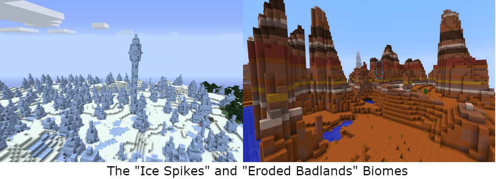

### Summary:
A biome in Minecraft is a region in Minecraft with varying geographical features. While some biomes are incredibly distinct and unique others are incredibly similar. Our goal for this project is to use Convolutional Neural Networks to create a program that predicts what biome the player is in through image recognition.

The Source Code for our project can be found [here.](https://github.com/gordonyin1337/Data_Miners)

Reports:

- [Proposal](proposal.html)
- [Status](status.html)
- [Final](final.html)

What's Markdown (`.md`)?

Markdown is markup that lets you write hypertext (HTML) documents
in easy-to-read and easy-to-write plain text.
No angle brackets `<></>` required for
paragraphs, lists, blockquotes, tables, etc.

This is a paragraph (in Markdown). Some more
text here.

This is another paragraph.

This is a list:

- Orange
- Apple
- Blueberry

$$x^2 = y^2$$

Just getting started with Markdown?
See the [HTML <-> Markdown Quick Reference (Cheat Sheet)][quickref].

[quickref]: https://github.com/mundimark/quickrefs/blob/master/HTML.md
