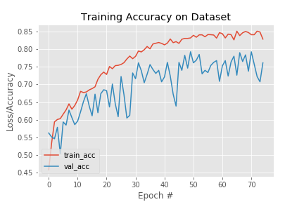
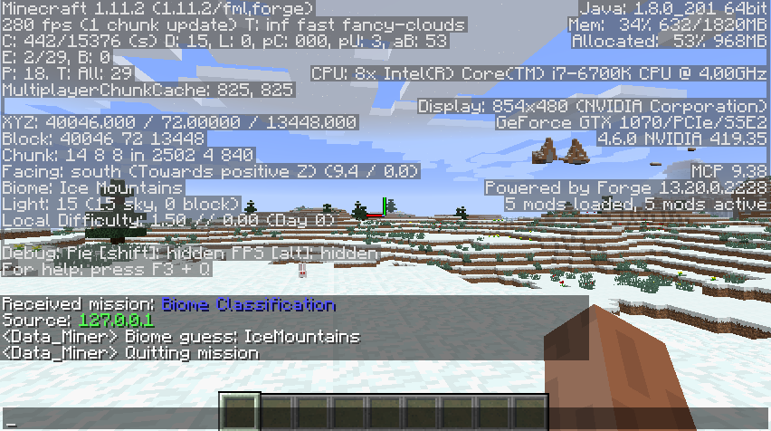

Status Report
===

### Project Summary:
The goal of our project is to classify Minecraft biomes using a Convolutional Neural Network and screenshots of the game as training and input data. This is a computer vision and image classification project that is not only able to print out the biome a Malmo agent is spawned in, but also compares a baseline SVM classification algorithm to a more advanced Convolutional Neural Network.

### Approach:
To gather image data for training our classification algorithms, we run a Malmo mission in which the agent spawns in a single biome, and teleports to 100 different locations using "tp" commands and a random number generator and takes 8 screenshots while spinning around. For our screenshot script, we used the modules win32gui, win32ui, ctypes, and PIL. It uses win32gui to locate the active Minecraft application and get its dimensions of the bounding rectangle. It then retrieves its device context and making a replica, making it compatible specifically to Minecraft. It then creates a bitmap with the device context as well as the dimensions. It then prints the client into the device context and creates an image using the bitmap information. If an image has been successfully created, it will be saved as a jpg file in the same directory as the script. After the mission, there is a total of 800 screenshots per biome to train with, separated into their own directories. We currently have 4 sets of biomes within the same "snowy" sub-category: Ice Plains, Ice Mountains, Cold Taiga, and Cold Taiga Hills.

For our baseline, we used the support vector machine classifier provided from the sklearn module. To utilize this classifier with images, we needed to convert the images to grayscale and get a histogram of oriented gradients (HOG) for each one. In order to do this, we used modules sklearn, skimage, PIL, cv2, os, and numpy. Using the main directory, we looped through each sub-directory of the biomes and used cv2 to read the image, turn it to grayscale, and resize it to keep the images consistent. We then used the hog function from sklearn, indicating pixels and cells per block, to return a list of numbers as well as the scaled image. We used a histogram list to keep track of the lists of numbers for each image as well as a list to keep track of the the classes of each. Once every image's HOG numbers have been calculated, we convert the histogram list into a numpy array as well as the labels, reshaping it to match the list. We used numpy's hstack function to concantenate the list with the labels and shuffled the data. We partitioned the training and test data using a 75/25 split and fitted the training data into our SVM classifier. Once the training data was fitted, we used the predict function with the test data and scored the accuracy of it.

To build a convolutional neural network for classifying biomes we utilized the Keras and TensorFlow libraries in Python. TensorFlow is a symbolic math library developed by Google and Keras runs on top of tensorflow, enabling user-friendly neural network experimentation. Using Keras we looped through directories of Minecraft screenshots and divided the images into training and test data using a 75/25 split. Since we had a relatively small dataset (800 images for each biome in Minecraft), we ran the risk of creating and overfit model. overfitting occurs when a function is too closely fit to a limited set of data points. In order to prevent this we applied random transformations such as zoom and rotation to every image in our training data. After processing the images we created a convolutional neural network to process the data. The model consists of three convolution layers with 32 nodes each. Each layer in the neural network utilizes Max Pooling, which takes the representation of the data from the previous layer and reduces the dimensionality of it, which reduces overfitting and reduces the computational cost of the model by reducing the number of parameters to learn. After creating the convolutional neural network we used the fit function with the training and test data in order to train the neural network. The model can cycle over the data many times, improving the neural network up to a certain point. We chose to cycle over the data 75 times since the accuracy seemed to stop increasing at around 70 cycles.

### Evaluation:
For our quantitiative evaluation, we compare the accuracy of our baseline classification algorithm and our Neural Network for training and test data. With a 75/25 split for training and test data, our baseline achieves an accuracy of 52% and our CNN achieves an accuracy of 73% on the test data. The Neural Network is significantly more accurate than the baseline according to this data. These are the plots of both classification algorithms’ accuracy:

For our qualitative evaluation, we use our working test model within Malmo. The agent randomly chooses between the biomes that the Neural Network was trained on, and is spawned in a random location within that one biome Minecraft world. The agent then gathers input data similarly to how we gathered the training data: the agent spins around in a 360 degree circle and takes 8 screenshots of the game. Our classifier then classifies these 8 screenshots and picks the highest occurring classification, then prints its guess to the Minecraft chat bar. We can evaluate the accuracy of its guess by pressing “F3” within the Minecraft game to bring up the debug menu, which contains the biome information.

### Remaining Goals and Challenges:
Our prototype model only classifies between 4 similar biomes within the same sub-category, so within the next several weeks, we hope to expand that to many, if not all, the biomes within Minecraft. The goal of our working model is to have the agent spawn into a full Minecraft world containing all biomes, and be able to classify the biome it is spawned in. We also want to add a feature that allows the agent to teleport to other locations, and classify the biome in each new location. 

Some of the most significant challenges we anticipate are the time-constraints, as gathering data for all the biomes as well as training our CNN on a substantial amount of data will take quite a bit of time. We also anticipate accuracy to reach a ceiling as we introduce more biomes, due to many biomes that look extremely similar, poor spawn and teleport locations that result in poor input data, and the limited amount of training data we can gather. Because one of our goals is to compare simpler classification algorithms to the more complex Convolutional Neural Network, we should still be able to show that one is more effective than the other, despite these setbacks. 

### Resources Used:
- [How to take a screenshot on Windows](https://stackoverflow.com/questions/19695214/python-screenshot-of-inactive-window-printwindow-win32gui)
- [How to get HOG features and train them with SVM](https://www.kaggle.com/manikg/training-svm-classifier-with-hog-features)
- [How to build a neural network](https://towardsdatascience.com/building-a-convolutional-neural-network-cnn-in-keras-329fbbadc5f5)
