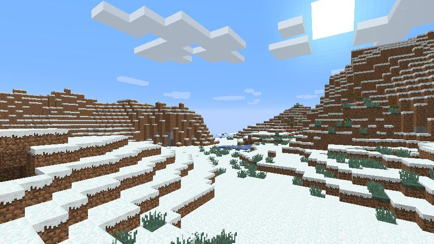

Status Report
===

### Project Summary:
The goal of our project is to classify Minecraft biomes using a Convolutional Neural Network and screenshots of the game as training and input data. This is a computer vision and image classification project that is not only able to print out the biome a Malmo agent is spawned in, but also compares a baseline SVM classification algorithm to a more advanced Convolutional Neural Network.

### Approach:
To gather image data for training our classification algorithms, we run a Malmo mission in which the agent spawns in a single biome, and teleports to 100 different locations using "tp" commands and a random number generator and takes 8 screenshots while spinning around. (ADD LIBRARIES USED AND HOW SCREENSHOTS ARE TAKEN) After the mission, there is a total of 800 screenshots per biome to train with. 

(ADD LIBRARIES FOR SVM AND PARAMETERS FOR BASELINE)
(ADD LIBRARIES FOR CNN AND PARAMETERS USED, FUNCTIONS, RECTIFIERS, EVERYTHING YOU CAN THINK OF)

